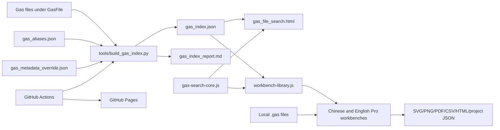
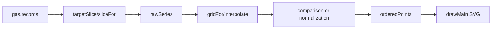

# GasFile_Viewer Code Design and Implementation Guide

[简体中文](代码设计与实现说明.md) | [Short Project Structure Guide](Project_Structure_and_File_Guide_EN.md) | [Back to English README](../README.md)

## 1. Scope

This guide is for maintainers and extension developers. It explains the GasFile_Viewer architecture, data flow, index format, matching algorithm, workbench parser and plotting pipeline, persistence, security boundaries, tests, and deployment. It describes modules and key function groups rather than restating every line of syntax.

The documented baseline is the repository state on 2026-07-14:

- Search index: schema v3.
- Complete workbench project format: version 2.
- Front end: native HTML, CSS, and JavaScript with no build step or third-party runtime dependency.
- Index generation and tests: Python 3 standard library.
- Deployment: GitHub Actions and GitHub Pages.

For operation, see the [English Workbench User Manual](Garfield_gas_workbench_pro_User_Manual_EN.md). For a file-level map, see the [Project Structure and File Guide](Project_Structure_and_File_Guide_EN.md).

## 2. Design Goals and Constraints

### 2.1 Primary goals

1. Search a large collection of Garfield gas files whose names may be irregular.
2. Derive composition, fractions, temperature, pressure, and transport-grid coverage from actual file content whenever possible.
3. Compare, plot, analyze, and export entirely in the browser without uploading local user data.
4. Rebuild and deploy the online index automatically when new gas files reach `main`.
5. Keep the Chinese and English workbenches on the same data formats and search rules.

### 2.2 Important tradeoffs

- **Static site:** simple deployment, no application server, and local-file operation; the page cannot write directly to GitHub or persist an index on a server.
- **Prebuilt index:** the browser avoids downloading hundreds of files for every search; the index must be rebuilt after data changes.
- **Content first, path fallback:** irregular names remain searchable; unknown fractions are reported instead of guessed.
- **Native front end:** the workbench is easy to distribute as a page; the two localized pages contain substantial parallel code and require disciplined synchronization.
- **Client-side physical conversions:** raw files remain unchanged and sources are inspectable; conversion rules require clear documentation and regression tests.

## 3. System Architecture



There is no runtime database. `gas_index.json` is a search-layer snapshot, while each `.gas` file remains the authoritative plotting source. The index narrows and previews candidates; the workbench downloads and parses the complete selected file again.

## 4. Index Builder Design

File: `tools/build_gas_index.py`

### 4.1 Scan scope

`build_index(root)` recursively walks regular files with `GasFile.rglob("*")`. It excludes:

- `gas_index.json`
- `gas_index_report.md`
- `gas_aliases.json`
- `gas_metadata_override.json`
- `.md` and `.pdf` files

Every other file is treated as a candidate gas file, so ingestion does not depend on a fixed extension. Paths are stored in POSIX form for browser and Pages compatibility.

### 4.2 One pass for text prefix and hash

`read_text_and_hash(path)` reads the complete file in binary chunks to compute SHA-256 while retaining only the first `256 KiB` for metadata parsing. This provides:

- A hash over the complete file regardless of size.
- Bounded retained text for index extraction.
- A digest that the workbench can verify after download.

The prefix is decoded as UTF-8 with replacement for invalid bytes. A read failure still produces an index record with `source=read_error` and `parse_status=error`, making the failure visible in the report instead of silently dropping the file.

### 4.3 Metadata precedence

Each record is built in this order:

1. `parse_identifier` reads the internal `Identifier:` line.
2. If no composition was parsed, `infer_components_from_path` detects known components in the path.
3. If temperature or pressure is absent, `parse_path_conditions` attempts to fill it from the path.
4. If the path appears in `gas_metadata_override.json`, `apply_override` replaces parsed fields.
5. `finalize_record` normalizes names, units, quality, and search text.

Manual override has the highest precedence and sets `source=manual_override`. Keys are repository-relative paths:

```json
{
  "GasFile/example/sample.gas": {
    "components": [
      {"name": "Ar", "fraction": 90},
      {"name": "CO2", "fraction": 10}
    ],
    "temperature": "293.15 K",
    "pressure": "1 atm"
  }
}
```

### 4.4 `Identifier:` parsing

`parse_identifier` extracts the complete line and then identifies:

- Composition parts in `name number%` form.
- Temperature after `T=...`.
- Pressure after `p=...`.

Composition is comma-separated. `normalize_name` strips outer quotes and internal whitespace, then applies `gas_aliases.json`. Duplicate component names retain the first occurrence. `compact_number` removes insignificant floating-point tails.

Alias configuration uses canonical groups:

```json
{
  "groups": [
    {"canonical": "C2H2F4", "aliases": ["R134a", "HFC134a"]}
  ]
}
```

### 4.5 Condition normalization

`parse_temperature_k` accepts K, C, and F:

```text
T(K) = T(C) + 273.15
T(K) = (T(F) - 32) * 5 / 9 + 273.15
```

`parse_pressure_pa` accepts Pa, kPa, MPa, bar, mbar, atm, Torr, and mmHg. Records preserve both display strings and normalized values:

- `temperature`, `pressure`
- `temperature_k`
- `pressure_pa`
- `pressure_atm = pressure_pa / 101325`

Non-finite or non-positive conditions return `null` and are subsequently marked by quality validation.

### 4.6 Transport-grid coverage

`parse_transport_coverage` extracts:

- Garfield `Version:`.
- `GASOK bits:`.
- The 2D-map flag and E, angle, B, excitation, and ionization counts from `Dimension:`.
- E/p, E-B angle, and magnetic-field ranges.

The Garfield magnetic-field grid is divided by 100 before storage in tesla. Coverage is for search-result inspection; it does not replace complete table parsing in the workbench.

### 4.7 Quality state

`finalize_record` produces these flags:

| Flag | Condition |
|---|---|
| `missing_components` | No component was identified. |
| `missing_component_fraction` | At least one component has no fraction. |
| `composition_sum_not_100` | Known fractions differ from 100% by more than 0.05 percentage points. |
| `missing_or_invalid_temperature` | Temperature cannot be normalized. |
| `missing_or_invalid_pressure` | Pressure cannot be normalized. |

`match_ready=true` only when composition, every fraction, temperature, and pressure are valid. `parse_status` conveys provenance quality:

- `ok`: internal Identifier or manual override.
- `fallback`: path-derived composition.
- `needs_review`: composition remains unknown.
- `error`: file read failed.

### 4.8 Index shape

Top-level structure:

```json
{
  "schema_version": 3,
  "summary": {
    "generated_at_utc": "...",
    "total_files": 0,
    "match_ready_files": 0,
    "status_counts": {},
    "quality_flag_counts": {},
    "component_counts": {}
  },
  "files": []
}
```

Each file record contains path, file name, directory, Identifier, component array, canonical names, aliases, conditions, quality flags, parse provenance, size, SHA-256, transport coverage, and preassembled `search_text`. Consumers can search quickly without reparsing the Identifier.

### 4.9 Writing, reporting, and staleness

- `write_index` writes JSON and the Markdown report.
- `render_report` summarizes statuses, quality issues, component counts, review candidates, and path fallbacks.
- `check_index` rebuilds the in-memory result and compares every record and the report while neutralizing the expected generation-time difference.

A meaningful change to file content, path, aliases, overrides, or parser behavior therefore makes `--check` fail.

## 5. Shared Search Core

File: `gas-search-core.js`

An immediately invoked function exports only a frozen `window.GasSearchCore`, preventing consumers from replacing the core API accidentally. It exposes unit constants, condition conversions, `evaluate`, and `sortResults`.

### 5.1 Query object

Both interfaces map controls to the same normalized shape:

```js
{
  mode: "nearest" | "range" | "exact",
  components: [{name, fraction, tolerance}],
  exactSet: true,
  temperature: 293.15,
  temperatureTolerance: 5,
  pressure: 101325,
  pressureTolerance: 10,
  text: "rpc",
  quality: "" | "ready" | "warning",
  sort: "overall" | "composition" | "temperature" | "pressure" | "path"
}
```

Temperature is in K, pressure is in Pa, component tolerance is in percentage points, and pressure tolerance is relative percent.

### 5.2 Candidate filtering

`evaluate(file, query)` applies hard conditions in this order:

1. Every text term must occur in `search_text`.
2. Apply the requested data-quality filter.
3. The file must contain every requested component.
4. With `exactSet=true`, component counts must match.
5. A requested fraction requires a numeric file fraction.
6. A requested temperature or pressure requires the corresponding normalized file value.

Failure returns `null`, so the caller excludes the file.

### 5.3 Distance definitions

Per-component signed fraction difference:

```text
d_i = actual_i - target_i
```

For a complete exact component set with all target fractions:

```text
compositionDelta = sum(abs(d_i)) / 2
```

The division by two avoids double-counting transferred mixture fraction when the complete mixture sums to 100%. Partial queries use the mean absolute difference of specified components.

Temperature difference is `file.temperature_k - target_temperature_k`. Relative pressure difference is:

```text
pressureSignedPct = (file_pressure - target_pressure) / target_pressure * 100
```

### 5.4 Search modes

- `nearest`: retain candidates that satisfy hard conditions and rank them.
- `range`: require every component, temperature, and relative-pressure difference to fall within its tolerance.
- `exact`: require an identical component set and absolute differences no greater than `1e-6` for each supplied numeric target.

### 5.5 Overall score

Each available dimension is normalized by its tolerance:

```text
compositionPart = compositionDelta / average(component tolerances)
temperaturePart = abs(temperatureDelta) / temperatureTolerance
pressurePart = abs(relativePressureDelta) / pressureTolerance
```

Denominators have a floor of `0.01`. The score is a weighted mean with weights 2 for composition and 1 each for temperature and pressure. Dimensions absent from the query do not enter the denominator. Lower is closer.

`sortResults` uses the selected primary metric, then overall score, then a numeric-aware path order to break ties deterministically.

## 6. Standalone Search Page

File: `gas_file_search.html`

The page contains its structure, responsive CSS, and controller code, and loads `gas-search-core.js` as its only shared dependency.

### 6.1 State and initialization

`state` stores index files, current results, available components, mode, and schema. `init` fetches `GasFile/gas_index.json` with a timestamp and `cache: no-store`, fills summary values, restores URL state, binds events, and searches.

Indexes older than schema v2 are rejected. Fetch failure explains that the page must run through GitHub Pages or local HTTP.

### 6.2 Input validation

`validateQuery` rejects duplicate components, fractions outside 0-100%, and complete-set totals farther than 0.05 percentage points from 100%. `balanceLast` fills the final fraction as `100 - sum(previous fractions)`.

### 6.3 Results and actions

`applySearch` calls shared `evaluate` for each record and then `sortResults`. `renderResults` displays rank, composition, conditions, deltas, quality, coverage, path, and size.

Each result can open or download the raw file, copy its path, or launch either localized workbench with `?gas=<encoded path>`.

`buildShareUrl` serializes mode, mixture, tolerances, conditions, text, quality, and sorting into the URL. `loadUrlState` performs the reverse. `exportCsv` exports the complete current result list and hashes.

## 7. Workbench Repository Integration

File: `workbench-library.js`

The script loads after the workbench and requires both `window.GasSearchCore` and `window.GarfieldWorkbenchBridge`. If either is missing, it exits without disrupting local workbench features.

### 7.1 Dynamic localized interface

The script selects Chinese or English strings from `<html lang>`, creates the `<dialog>`, styles, controls, and result table, and inserts launch buttons into the file area. Matching still comes from the shared core.

### 7.2 Download security boundary

`safeFile` accepts an indexed path only when it:

- Starts with `GasFile/`.
- Contains no `..` or backslash.
- Contains no `?` or `#`.
- Resolves to the current origin on HTTP/HTTPS pages.

The loader also enforces a 200 MiB indexed-size limit per selection, runs at most three download workers, supports cancellation with `AbortController`, verifies SHA-256 when Web Crypto is available, and deduplicates by source path or hash.

### 7.3 Workbench bridge

The workbench publishes:

```js
window.GarfieldWorkbenchBridge = {
  addGasTexts,
  getLoadedSources
};
```

After downloading and decoding a file, the library passes `rawText`, source path, hash, index generation time, and indexed metadata to `addGasTexts`. The workbench performs final Garfield parsing; an index record never becomes plot data directly.

`openFromQuery` reads all `gas` query parameters, opens the dialog, verifies each path against the loaded index, and downloads selected files. This implements standalone-search-to-workbench transfer.

## 8. Pro Workbench Design

Files:

- `garfield_gas_workbench_pro.html`: Chinese.
- `garfield_gas_workbench_pro_english.html`: English.

Each is a self-contained application: HTML defines controls, CSS defines layout, and inline JavaScript handles parsing, state, plots, analysis, and export. The shared search core and repository library load at the end.

### 8.1 Runtime state

The central `state` contains:

- `gases`: loaded parsed files, display styles, and source metadata.
- `activeId`, `nextId`, `loadCounter`: current file and stable identities.
- `annotations`, `customParams`, `fit`: analysis objects.
- `view`, `geometry`, `drag`: plot transforms and interaction.
- `history`, `future`: undo and redo snapshots.
- `targetAngle`, `targetB`: physical slice targets across files.

A gas entry combines immutable parsed data with color, line and marker style, opacity, custom label, and provenance. Styling does not mutate `gas.records`.

## 9. Garfield Parsing in the Workbench

Key functions: `parseGasFile`, `parseLevels`, `nums`, and `section`.

### 9.1 File sections

The parser requires `The gas tables follow:`, an `H Extr:` footer start, and a valid `Dimension:` line. It splits the text into header, numeric table, and footer. The header provides version, GASOK, Identifier, dimensions, and grids; the footer provides `PGAS` and `TGAS`.

### 9.2 Grid and record size

`Dimension: <T/F> nE nAngles nB nExc nIon` defines the table. Records are consumed in this order:

```text
for each E index
  for each angle index
    for each B index
      read one transport record
```

When the 2D-map flag is `T`, record size is:

```text
17 + nExc + nIon
```

Otherwise the record contains multiple value/error pairs:

```text
33 + 2 * (nExc + nIon)
```

Numeric parsing accepts Fortran `D` exponents. Incomplete grids or too few values are fatal. Extra values are reported in integrity metadata instead of changing dimensions silently.

### 9.3 Conditions and number density

`PGAS` falls back to 760 Torr and `TGAS` to 293.15 K. Number density uses the ideal gas relation:

```text
N = pressure_Torr * 133.32236842105263 / (k_B * temperature_K)
```

with `k_B = 1.380649e-23`. The fallback keeps older files usable, but maintainers should expose and review the integrity and raw-data panels for scientific decisions.

### 9.4 Raw and derived values

Each record retains a `raw` structure, grid coordinates, and derived values. Examples:

```text
E = (E/p) * p
E/N [Td] = E * 100 / N / 1e-21
alpha = p * exp(raw.alpha)
eta = p * exp(raw.eta)
alphaEff = alpha - eta
DL = raw.dl / sqrt(p)
DT = raw.dt / sqrt(p)
```

Drift, diffusion, Townsend, attachment, mobility, tensor, dissociation, excitation, and ionization quantities retain explicit provenance. Exponents below `-745` map to zero to avoid JavaScript underflow anomalies.

`baseParams` is the built-in parameter registry with group, key, label, source, unit, and GASOK bit. `allParams` adds user formulas and the active file's individual excitation and ionization channels.

### 9.5 Legend composition source

`componentMap` calls `identifierComposition` first. When `Identifier:` contains parseable percentage components, that result is used exclusively, and `canonicalGasName` normalizes `iC4H10` and `i-C4H10` to `i-C4H10`. `arrayComposition` interprets the Mixture array only when the Identifier supplies no component fractions.

The two sources must not be merged blindly. A Mixture array stores positions and fractions, while the gas-number table may vary by Garfield/Magboltz version. An incorrect fixed mapping can invent component names and place them beside the correct Identifier entries. This precedence is shared by legends, component sorting, and composition scans.

## 10. Loading, Provenance, and State

### 10.1 Local files

`loadFiles` reads every browser `File` through `arrayBuffer()`, decodes text, computes SHA-256 when available, and forwards entries to `addGasTexts`. Drag-and-drop and file selection share the same path.

### 10.2 Repository files

`workbench-library.js` supplies verified text and provenance. `addGasTexts` deduplicates by hash or path and calls `parseGasFile` independently for each item, so one failure does not prevent the remaining files from loading.

### 10.3 Undo and redo

`snapshot` records workbench state before undoable operations; `undo` and `redo` move snapshots between `history` and `future`. High-frequency view transforms are transient interaction state, not a substitute for versioning scientific data.

## 11. Plot Data Pipeline



### 11.1 B and angle slices

The active file controls target physical B and angle values. `targetSlice`/`sliceFor` finds each file's nearest grid indices rather than assuming identical index positions. The slice remains ordered by source electric-field index `ie`.

### 11.2 Values and errors

- `getVal` reads normal fields, tensor components, excitation/ionization channels, or custom formulas.
- `getErr` reads `raw.errors` and applies supported conversion scale factors.
- `xVal` uses coordinate fields for E, E/p, and E/N, and `getVal` for parametric X variables.

`rawSeries` retains X, Y, horizontal and vertical errors, and source E, E/p, E/N, B, and angle for every point. Invalid values are removed before plotting and reported in the chart note.

### 11.3 Parametric X axes

X may be E, E/p, E/N, any built-in transport parameter, a custom derived parameter, or an active-file excitation or ionization channel.

Transport parameters may be non-monotonic with electric field. The default therefore preserves source field-sweep order. Users can select ascending X or points only. X and Y may intentionally be the same diagnostic parameter.

### 11.4 Common grids and interpolation

Ordinary field coordinates build a grid in the selected X variable. Parametric mode never tries to invert a potentially non-monotonic X. It aligns on underlying `sourceEoverP` and then maps the aligned records to X and Y values.

`interpolate(points, value, mode, key)` supports linear interpolation, logarithmic-X interpolation, or common original points without interpolation. Grid selection supports intersection, union, reference-file values, and custom start/end/step. In parametric mode, a custom grid still means underlying E/p.

### 11.5 Comparison and normalization

`prepared` can produce raw values, difference from reference, relative percent difference, ratio to reference, self-maximum normalization, or normalization at a specified X.

For the last option in parametric mode, the nearest native X point is used to avoid a multivalued inverse. Division by zero and non-finite results are removed.

### 11.6 SVG rendering and interaction

`drawMain` computes ranges, linear/log scales, ticks, grids, paths, markers, uncertainties, fits, annotations, dual axes, and legends, then emits SVG elements. `state.geometry` stores the plot rectangle and active ranges for wheel zoom, drag pan or box zoom, automatic/manual ranges, and crosshair readout.

Parametric crosshairs use the nearest plotted point; ordinary monotonic coordinates can interpolate. This avoids collapsing multiple field records that share the same parameter X into a false single-valued function.

## 12. Analysis Features

### 12.1 Statistics and features

`statistics` computes point count, minimum, maximum, mean, median, and trapezoidal integral, and extracts extrema, zero crossings, and an approximate drift-velocity plateau start within an optional X interval. It consumes prepared series, so current slices, comparison, and grid settings are reflected.

### 12.2 Derived formulas

`compileCustom` compiles an expression using variables from `makeVars`, including E, E/p, E/N, alpha, eta, drift, diffusion, pressure, temperature, number density, and `Math`. Expressions run only in the local browser.

This is not a strong security sandbox. Do not load formulas from an untrusted project file. Expression exceptions and non-finite values become invalid points.

### 12.3 Fitting

- `solveLinear` solves the coefficient system.
- `polynomialFit` builds a least-squares polynomial problem with degree 1-6.
- The exponential model linearizes positive Y through logarithms.
- `runFit` computes coefficients, residual metrics, and the overlay.

Changing the X variable clears the old fit so that a result from the previous coordinate system is not plotted against a new one.

### 12.4 Scans, heat maps, and panels

- `drawScan` compares pressure, temperature, or a selected component fraction near a fixed field value.
- `drawHeat` arranges E-B or E-angle data as heat maps, contours, or projected surfaces.
- `drawMulti` reuses plot data for multiple parameter panels.
- `exportBatch` uses an internal uncompressed ZIP writer for batch SVG export.

These features organize numerical data but do not determine whether different gas files are physically interchangeable.

## 13. Export and Persistence

### 13.1 Figures and reports

- SVG: `exportSvgMarkup` creates complete vector markup.
- PNG: SVG is rendered through Canvas at the requested dimensions.
- PDF: Canvas creates JPEG data and `pdfFromJpeg` writes a minimal PDF object structure.
- HTML report: embeds the main plot, file summary, feature points, and statistics.
- CSV: exports X/Y parameters, units, errors, source E/E/p/E/N/B/angle, point order, and interpolation flag.

The built-in PDF contains a raster image. Prefer SVG or browser printing when vector text is required.

### 13.2 Plot templates

Templates store only the values returned by `projectSettings()` under `garfieldPlotTemplates` in browser `localStorage`. They do not contain gas files and are lost when site data is cleared or when moving to another browser profile.

### 13.3 Complete projects

`saveProject` emits:

```js
{
  type: "GarfieldGasWorkbenchProject",
  version: 2,
  created,
  gases,
  activeId,
  annotations,
  customParams,
  settings
}
```

Each gas entry retains `rawText` and provenance. `loadProjectFile` reparses text with the current `parseGasFile` instead of trusting an old parsed object, then recompiles formulas and applies settings.

New fields should have defaults and preserve version 2 compatibility whenever possible. Raise the version only for an incompatible semantic change.

## 14. Legacy Viewer

`garfield_gas_multi_file_viewer_advanced_legend.html` is an independent Chinese single-page application with its own parser, plotting, interactions, legend, and exports. It does not load the shared search scripts or use the Pro project format.

Maintain it for established workflows and reproduction. New search, analysis, and project features normally belong only in the two Pro files. When fixing a fundamental Garfield parsing defect, assess the legacy parser separately because no code is shared.

## 15. Test Design

### 15.1 Python behavioral tests

`tests/test_build_gas_index.py` covers:

| Area | Assertions |
|---|---|
| Temperature | K, C, F conversion and invalid units. |
| Pressure | atm, mbar, bar, Torr conversion and non-positive values. |
| Identifier | Aliases, component fractions, temperature, and pressure. |
| Quality | `match_ready`, composition total, and missing-fraction flags. |
| Coverage | Version, GASOK, Dimension, E/p, B, and angle ranges. |
| Lifecycle | Changed gas content makes `check_index` detect staleness. |

### 15.2 Static web contract tests

`tests/test_web_integration.py` does not launch a browser. It checks source contracts for localized workbenches and bridges, path and origin restrictions, SHA-256, the 200 MiB guard, cancellation, parametric X controls and E/p alignment, X errors, CSV fields, shared-core use, and both workbench links.

### 15.3 Test boundary

The current suite does not replace browser end-to-end checks. High-risk changes should also verify file drag-and-drop, nonblank responsive SVG output, cancellation and hash failure, project round trips, and all figure/data export formats.

## 16. GitHub Actions and Pages

File: `.github/workflows/gas-search.yml`

### 16.1 Triggers

The workflow runs for selected file changes pushed to `main`, matching pull requests, and manual `workflow_dispatch` runs.

The path list includes `Doc/**`, so an independent user-manual or developer-guide change also runs validation and updates Pages.

### 16.2 Jobs

`validate-and-build` checks out the repository, configures Python 3.11, runs all unittest cases, rebuilds the pretty index, verifies it with `--check`, and uploads the whole repository as a Pages artifact for non-pull-request events.

`deploy` runs only outside pull requests and publishes through the GitHub Pages environment. The `gas-search-pages` concurrency group cancels an older in-progress run so stale content cannot deploy after a newer commit.

## 17. Extension Patterns

### 17.1 Add an index field

1. Parse and emit it in `build_gas_index.py`.
2. Raise `SCHEMA_VERSION` if compatibility requires it.
3. Test normal, missing, and malformed inputs.
4. Update `gas-search-core.js` or page consumers.
5. Update localized documentation and reporting.
6. Rebuild and check compatibility with older entry points.

### 17.2 Add a search dimension or weight

1. Collect a normalized target and tolerance in each query interface.
2. Add missing-value exclusion, delta, and score handling to `GasSearchCore.evaluate`.
3. Extend `metricValue` and sorting controls.
4. Explain the metric in both result interfaces.
5. Test boundaries, zero tolerances, and tie order.

Weight changes alter the meaning of “nearest” for every user and should be documented as explicit behavior changes.

### 17.3 Add a workbench plot parameter

1. Add metadata to `baseParams` if the value already exists on records.
2. Otherwise derive it in `parseGasFile` and propagate errors in `getErr`.
3. Synchronize localized labels, units, and provenance.
4. Verify both X and Y selector use.
5. Verify CSV, source tables, project restoration, and parametric X behavior.

### 17.4 Add a language

The workbench is not currently a runtime language-pack architecture. A third language means another synchronized Pro page, while `workbench-library.js` can add another string set. Before long-term support for another language, extracting shared workbench logic into JavaScript modules is the lower-risk design.

## 18. Localization Synchronization Rules

For every change to the two Pro workbenches, verify:

- Identical DOM IDs and option values.
- Identical parameter keys, units, conversions, and GASOK bits.
- Identical parser, plot pipeline, analysis, and export fields.
- Identical `projectSettings` fields and project version.
- Identical bridge and source-provenance fields.
- Only displayed language differs, not algorithms.

Add static contract assertions for new cross-language invariants, but still compare corresponding source because string tests cannot detect every semantic drift.

## 19. Known Limitations and Risks

- “Refresh index” only redownloads deployed JSON; it cannot scan local files or write GitHub.
- The Pages-generated index is not committed automatically, so a local clone can have an older committed index than the live site.
- Path fallback recognizes only known aliases and cannot invent fractions, so such records cannot participate in full numeric matching.
- `Identifier:` parsing assumes a conventional format; complex punctuation, unusual units, or duplicates may need parser work or a verified override.
- Custom formulas use dynamic JavaScript and should not be loaded from untrusted project files.
- Parallel localized workbench files can drift.
- Dense inline workbench code has limited module-level testing and should be split as growth continues.
- The legacy and Pro parsers are independent, so format fixes may be needed in multiple places.
- A numerically nearest result is not evidence that a gas file is physically interchangeable with the target condition.

## 20. Maintenance Runbook

### 20.1 Gas-file changes

```bash
python3 tools/build_gas_index.py --pretty
python3 tools/build_gas_index.py --check
python3 -m unittest discover -s tests -v
```

Then inspect new warning, fallback, and needs-review entries in `GasFile/gas_index_report.md`.

### 20.2 Front-end changes

```bash
python3 -m http.server 8000
```

Open `/gas_file_search.html` and both Pro workbenches through HTTP. Verify at least one local file, one repository file, one comparison plot, and one saved-project round trip.

### 20.3 Pre-commit checks

```bash
python3 tools/build_gas_index.py --check
python3 -m unittest discover -s tests -v
git diff --check
git status --short
```

After pushing, confirm `Gas search validation and Pages deployment` succeeds and inspect the live pages. Use index refresh or a hard reload when browser caching exposes old content.

## 21. Recommended Refactoring Order

1. Extract common Pro workbench JavaScript so localized pages differ primarily in text.
2. Add deterministic numerical unit tests for `GasSearchCore.evaluate` that run in Node or a browser harness.
3. Extract the Garfield parser and cover minimal real fixtures for 2D/non-2D records, errors, excitation, and ionization.
4. Add browser end-to-end coverage for load, repository insertion, plotting, and project round trips.
5. Publish machine-readable JSON Schemas for the search index and project format.

Perform these steps incrementally and lock current behavior with tests before moving code. Module extraction should not simultaneously alter physical conversions or scientific output.
