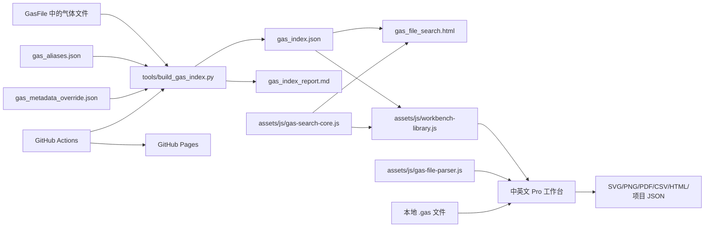
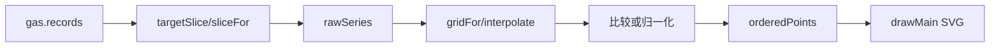

# GasFile_Viewer 代码设计与实现说明

[English](Code_Design_and_Implementation_EN.md) | [项目结构简明说明](项目结构与文件说明.md) | [返回中文 README](../README.zh-CN.md)

## 1. 文档定位

本文面向维护者和二次开发者，说明 GasFile_Viewer 的架构、数据流、索引格式、检索算法、工作台解析与绘图实现、持久化、安全边界、测试和部署方式。本文按模块和关键函数组解释代码，不逐行复述语法。

当前说明基于 2026-07-15 的仓库状态：

- 检索索引：schema v3。
- 完整工作台项目格式：version 2。
- 前端：原生 HTML、CSS、JavaScript，无构建步骤和第三方运行时依赖。
- 索引生成与测试：Python 3 标准库。
- 部署：GitHub Actions 和 GitHub Pages。

用户操作请参考[工作台中文使用手册](Garfield_gas_workbench_pro_使用说明.md)。文件级快速导航请参考[项目结构与文件说明](项目结构与文件说明.md)。

## 2. 设计目标与约束

### 2.1 主要目标

1. 直接检索大量、命名不一定规范的 Garfield 气体文件。
2. 尽可能从文件实际内容得到成分、比例、温度、压强和输运网格覆盖。
3. 在浏览器中完成文件比较、科研绘图、分析和导出，不上传用户本地数据。
4. 新气体文件进入 `main` 后自动生成在线索引并部署。
5. 中英文工作台共享相同数据格式和检索规则。

### 2.2 关键取舍

- **静态站点**：部署简单、无需后端、可离线使用本地文件；代价是网页不能直接写回 GitHub，也不能在服务器端动态持久化索引。
- **预生成索引**：浏览器不必逐个下载数百个气体文件；代价是索引必须在数据变化后重建。
- **内容优先、路径回退**：不规则文件名仍可检索；无法从内容确认比例时会产生质量警告，而不是猜测完整数值。
- **原生前端**：工作台可作为静态文件分发；两个本地化页面已经共享解析器，其余界面和绘图代码仍需严格同步。
- **客户端物理量换算**：原始文件保持不变，使用者可检查来源；代价是换算规则必须有明确文档和回归测试。

## 3. 总体架构



运行时没有数据库。`gas_index.json` 是检索层的数据快照，`.gas` 文件是工作台的最终数据源。索引用于筛选和预览，工作台仍会下载并重新解析完整文件。

## 4. 索引生成器设计

文件：`tools/build_gas_index.py`

### 4.1 扫描范围

`build_index(root)` 使用 `GasFile.rglob("*")` 递归扫描普通文件，并跳过：

- `gas_index.json`
- `gas_index_report.md`
- `gas_aliases.json`
- `gas_metadata_override.json`
- `.md` 和 `.pdf` 后缀

其余文件都被视为候选气体文件，因此新增文件不依赖固定扩展名。路径按 POSIX 风格保存，便于浏览器和 GitHub Pages 使用。

### 4.2 一次读取同时完成摘要和哈希

`read_text_and_hash(path)` 以二进制分块读取完整文件并计算 SHA-256，同时只保留前 `256 KiB` 用于文本元数据解析。这样可以：

- 对任意大小文件获得完整内容哈希。
- 避免仅为索引元数据将全部文件文本长期保存在内存中。
- 让工作台下载后可以验证索引记录与实际内容一致。

文本使用 UTF-8 解码并以替换字符容忍坏字节。读取失败时仍生成记录，`source=read_error`、`parse_status=error`，便于报告而不是静默丢失文件。

### 4.3 内容解析优先级

每个文件按以下优先级生成元数据：

1. `parse_identifier` 读取文件内部 `Identifier:`。
2. 若没有可用成分，`infer_components_from_path` 从路径识别已知成分。
3. 若温度或压强缺失，`parse_path_conditions` 从路径补充条件。
4. 若路径存在于 `gas_metadata_override.json`，`apply_override` 覆盖前述结果。
5. `finalize_record` 统一名称、单位、质量状态和检索文本。

人工覆盖优先级最高，并将 `source` 标记为 `manual_override`。覆盖键必须是仓库相对路径，例如：

```json
{
  "GasFile/example/sample.gas": {
    "components": [
      {"name": "Ar", "fraction": 90},
      {"name": "CO2", "fraction": 10}
    ],
    "temperature": "293.15 K",
    "pressure": "1 atm"
  }
}
```

### 4.4 `Identifier:` 解析

`parse_identifier` 先提取整行，再分别识别：

- 成分片段：`名称 数值%`
- 温度：`T=...`
- 压强：`p=...`

成分使用逗号分隔。`normalize_name` 删除外层引号和名称内部空白，再通过 `gas_aliases.json` 归一化。重复成分只保留第一次出现，比例经 `compact_number` 消除无意义浮点尾数。

别名配置结构为：

```json
{
  "groups": [
    {"canonical": "C2H2F4", "aliases": ["R134a", "HFC134a"]}
  ]
}
```

### 4.5 温度和压强标准化

`parse_temperature_k` 支持 K、C、F，并转换为 K：

```text
T(K) = T(C) + 273.15
T(K) = (T(F) - 32) * 5 / 9 + 273.15
```

`parse_pressure_pa` 支持 Pa、kPa、MPa、bar、mbar、atm、Torr 和 mmHg。索引同时保存：

- 原始字符串 `temperature`、`pressure`
- `temperature_k`
- `pressure_pa`
- `pressure_atm = pressure_pa / 101325`

非有限值、非正温度或非正压强返回 `null`，随后由质量检查标记。

### 4.6 输运网格覆盖解析

`parse_transport_coverage` 从文件头提取：

- Garfield `Version:`
- `GASOK bits:`
- `Dimension:` 中二维映射标志和 E、角度、B、激发、电离数量
- E/p 网格范围
- E-B 夹角范围
- 磁场范围

Garfield 文件中的磁场网格除以 100 后存为 tesla。覆盖范围用于检索结果预览，不替代工作台对完整表格的解析。

### 4.7 质量状态

`finalize_record` 生成以下质量标记：

| 标记 | 条件 |
|---|---|
| `missing_components` | 未识别任何成分。 |
| `missing_component_fraction` | 至少一个成分缺少比例。 |
| `composition_sum_not_100` | 已知比例总和与 100% 相差超过 0.05 个百分点。 |
| `missing_or_invalid_temperature` | 温度不能标准化。 |
| `missing_or_invalid_pressure` | 压强不能标准化。 |

只有成分、所有比例、温度和压强均有效时，`match_ready=true`。`parse_status` 说明解析来源可信度：

- `ok`：Identifier 或人工覆盖成功。
- `fallback`：依赖路径识别。
- `needs_review`：仍不能识别成分。
- `error`：文件读取失败。

### 4.8 索引结构

顶层结构：

```json
{
  "schema_version": 3,
  "summary": {
    "generated_at_utc": "...",
    "total_files": 0,
    "match_ready_files": 0,
    "status_counts": {},
    "quality_flag_counts": {},
    "component_counts": {}
  },
  "files": []
}
```

每条文件记录包含路径、文件名、目录、Identifier、成分数组、标准名称、别名、温压、质量标记、解析来源、文件大小、SHA-256、覆盖范围和预拼接的 `search_text`。前端不需要重新解释原始 Identifier 即可快速筛选。

### 4.9 写入、报告和过期检查

- `write_index` 写入 JSON 和 Markdown 报告。
- `render_report` 汇总状态、质量问题、成分数量、待复核文件和路径回退文件。
- `check_index` 重新构建内存结果，并忽略生成时间差异后比较全部记录和报告。

因此，文件内容、路径、别名、覆盖配置或解析代码的任何有效变化都会令 `--check` 失败。

## 5. 共享检索核心

文件：`assets/js/gas-search-core.js`

脚本通过立即执行函数只导出冻结的 `window.GasSearchCore`，避免消费者意外修改核心 API。导出内容包括单位常量、单位换算、`evaluate` 和 `sortResults`。

### 5.1 查询对象

两个检索入口都把界面状态转换为统一查询对象：

```js
{
  mode: "nearest" | "range" | "exact",
  components: [{name, fraction, tolerance}],
  exactSet: false,
  temperature: 293.15,
  temperatureTolerance: 5,
  pressure: 101325,
  pressureTolerance: 10,
  text: "rpc",
  quality: "" | "ready" | "warning",
  sort: "overall" | "composition" | "temperature" | "pressure" | "path"
}
```

温度统一为 K，压强统一为 Pa。成分容差单位为百分点，压强容差是相对百分比。

两个界面的 `exactSet` 默认值均为 `false`；只有用户勾选 **Exact component set** 或进入 `exact` 模式时才启用严格成分集合匹配。

### 5.2 候选过滤

`evaluate(file, query)` 依次执行：

1. 文本词项必须全部出现在 `search_text` 中。
2. 应用数据质量筛选。
3. 文件必须包含所有目标成分。
4. `exactSet=true` 时，文件成分数量必须与查询相同。
5. 查询指定比例时，文件必须具有该成分的数值比例。
6. 查询指定温度或压强时，文件必须具有对应标准化值。

任何硬条件失败都返回 `null`，调用方不再显示该文件。

### 5.3 差值定义

单一成分比例差：

```text
d_i = actual_i - target_i
```

完整成分集合且所有目标比例已提供时：

```text
compositionDelta = sum(abs(d_i)) / 2
```

除以 2 是因为在总和固定为 100% 的完整混合气中，一种成分减少必然对应另一种成分增加，直接求和会重复计算转移量。非完整查询使用各已输入成分绝对差的平均值。

温度差为 `file.temperature_k - target_temperature_k`。相对压强差为：

```text
pressureSignedPct = (file_pressure - target_pressure) / target_pressure * 100
```

### 5.4 三种检索模式

- `nearest`：硬条件通过后保留候选，并按评分排序。
- `range`：各成分差不得超过各自容差，温差和相对压差不得超过查询容差。
- `exact`：成分集合完全一致，所有已输入数值的绝对差不超过 `1e-6`。

### 5.5 综合评分

每个可用维度先除以对应容差形成无量纲差异：

```text
compositionPart = compositionDelta / average(component tolerances)
temperaturePart = abs(temperatureDelta) / temperatureTolerance
pressurePart = abs(relativePressureDelta) / pressureTolerance
```

容差分母最小按 `0.01` 处理，避免除零。综合分数为加权平均：成分权重 2，温度 1，压强 1。未在查询中指定的维度不参与分母。分数越小越接近。

`sortResults` 先按用户选择的主指标排序，再按综合分数，最后按带数字感知的路径顺序稳定破同分。

## 6. 独立检索页实现

文件：`gas_file_search.html`

该文件包含页面结构、响应式 CSS 和页面控制代码，加载 `assets/js/gas-search-core.js` 作为唯一共享依赖。

### 6.1 页面状态和初始化

`state` 保存文件记录、结果、可选成分、模式和 schema。`init` 使用带时间戳和 `cache: no-store` 的请求读取 `GasFile/gas_index.json`，填充汇总数据后恢复 URL 查询状态、绑定事件并执行第一次检索。

索引低于 schema v2 会被拒绝。读取失败时显示必须通过 GitHub Pages 或本地 HTTP 服务访问的提示。

### 6.2 输入验证

`validateQuery` 拒绝：

- 重复气体成分。
- 小于 0% 或大于 100% 的比例。
- 在完整成分集合中与 100% 相差超过 0.05 个百分点的比例总和。

`balanceLast` 用 `100 - 前面比例之和` 自动填写最后一种气体。

### 6.3 结果和操作

`applySearch` 对索引记录调用共享 `evaluate`，再调用 `sortResults`。`renderResults` 展示排名、成分、温压、差值、数据质量、输运覆盖、路径和文件大小。

每条结果可：

- 打开或下载原始气体文件。
- 复制仓库路径。
- 通过 `?gas=<encoded path>` 打开中文或英文工作台并自动加入文件。

`buildShareUrl` 将模式、混合气、容差、条件、文本、质量和排序编码到 URL。`loadUrlState` 完成逆过程。`exportCsv` 导出当前完整结果集及 SHA-256。

## 7. 工作台仓库检索集成

文件：`assets/js/workbench-library.js`

该脚本在工作台本体完成初始化后加载，要求：

- `window.GasSearchCore`
- `window.GarfieldWorkbenchBridge`

若任一接口缺失，脚本直接退出，不破坏工作台原有本地功能。

### 7.1 动态界面与本地化

脚本根据 `<html lang>` 选择中英文文案，动态创建 `<dialog>`、样式、查询控件和结果表，并在工作台文件区域加入启动按钮。查询算法仍来自共享核心。

### 7.2 下载安全边界

`safeFile` 只接受满足全部条件的索引路径：

- 以 `GasFile/` 开头。
- 不包含 `..` 或反斜杠。
- 不包含 `?` 或 `#`。
- HTTP/HTTPS 页面中解析后的 URL 与当前页面同源。

此外：

- 单次选择总索引大小不得超过 200 MiB。
- 最多三个并发下载 worker。
- 使用 `AbortController` 支持取消。
- 浏览器支持 Web Crypto 时，对下载字节重新计算 SHA-256。
- 以来源路径或哈希去重。

### 7.3 与工作台的桥接

工作台暴露：

```js
window.GarfieldWorkbenchBridge = {
  addGasTexts,
  getLoadedSources
};
```

检索库下载并解码文件后，把 `rawText`、来源路径、哈希、索引生成时间和索引元数据传给 `addGasTexts`。工作台负责最终 Garfield 格式解析；索引记录本身不会直接变成绘图数据。

`openFromQuery` 读取所有 `gas` 查询参数，打开检索对话框、确认路径存在于索引，再自动下载和加入。这是独立检索页跳转工作台的实现基础。

## 8. Pro 工作台总体设计

文件：

- `garfield_gas_workbench_pro.html`：中文。
- `garfield_gas_workbench_pro_english.html`：英文。
- `garfield_workbench_offline_zh.html`：自动生成的中文单文件离线版。
- `garfield_workbench_offline_en.html`：自动生成的英文单文件离线版。

两个 HTML 文件定义工作台控件和布局，内联 JavaScript 负责状态、绘图、分析与导出。两者都先加载 `assets/js/gas-file-parser.js` 和本地化包装层，末尾再加载共享检索核心及仓库集成库。

`tools/build_standalone_workbenches.py` 将三个共享 JavaScript 文件嵌入两个源工作台并生成离线版。生成文件可通过 `file://` 直接打开并读取用户选择的本地气体文件；开发时仍只维护共享模块和两个源工作台。`--check` 用于防止生成文件落后于源码。

### 8.1 运行时状态

核心 `state` 保存：

- `gases`：已加载文件及其显示样式和来源信息。
- `activeId`、`nextId`、`loadCounter`：当前文件和稳定身份。
- `annotations`、`customParams`、`fit`：分析对象。
- `view`、`geometry`、`drag`：缩放和图表交互。
- `history`、`future`：撤销和重做快照。
- `targetAngle`、`targetB`：跨文件切片的目标物理值。

文件条目把解析结果 `gas` 与颜色、线型、点型、透明度、自定义标签及来源元数据放在一起。绘图样式不修改 `gas.records`。

## 9. 工作台 Garfield 文件解析

文件：`assets/js/gas-file-parser.js`

模块在浏览器中导出 `GarfieldGasParser.parse`，在 Node 中导出 `module.exports`。中英文页面只保留很薄的 `parseGasFile` 包装器，用于提供对应语言的错误提示和 Identifier 缺省文案。内部辅助函数包括 `parseLevels`、`numbers` 和 `section`。

### 9.1 文件分段

解析器要求：

- 表格开始标记：`The gas tables follow:`
- 页脚开始标记：`H Extr:`
- 可解析的 `Dimension:` 行

文本被分为 `header`、气体数值表和 `footer`。表头提供版本、GASOK、Identifier、维度和网格；页脚提供 `PGAS` 与 `TGAS`。

### 9.2 网格和记录长度

`Dimension: <T/F> nE nAngles nB nExc nIon` 决定网格。解析顺序固定为：

```text
for each E index
  for each angle index
    for each B index
      read one transport record
```

二维映射标志为 `T` 时，记录长度为：

```text
17 + nExc + nIon
```

否则记录包含多组“值 + 误差”对，长度为：

```text
33 + 2 * (nExc + nIon)
```

数值支持 Fortran `D` 指数。若网格数量不完整或数值少于预期，解析立即报错。当每条基础记录末尾具有数量相同的扩展值时，解析器按实际记录长度前进，把扩展内容保存在 `extensionValues`，并通过 `extraValuesPerRecord` 报告。若多余数值不能在所有记录间整除，则拒绝解析，避免科研数据发生静默错位。

### 9.3 条件和数密度

`PGAS` 默认回退为 760 Torr，`TGAS` 默认回退为 293.15 K。数密度使用理想气体关系：

```text
N = pressure_Torr * 133.32236842105263 / (k_B * temperature_K)
```

其中 `k_B = 1.380649e-23`。该回退保证旧文件可显示，但完整性面板和原始数据视图应作为科研判断依据。

### 9.4 原始量和派生量

每个 record 同时保存原始结构 `raw`、网格坐标和常用派生值。例如：

```text
E = (E/p) * p
E/N [Td] = E * 100 / N / 1e-21
alpha = p * exp(raw.alpha)
eta = p * exp(raw.eta)
alphaEff = alpha - eta
DL = raw.dl / sqrt(p)
DT = raw.dt / sqrt(p)
```

漂移速度、扩散、Townsend、吸附、迁移率、扩散张量、解离、激发和电离速率都保留明确来源。指数小于 `-745` 时按 0 处理，避免 JavaScript 下溢异常。

`baseParams` 是内置参数注册表，描述分组、键、标签、来源、单位及对应 GASOK 位。`allParams` 在此基础上追加用户公式以及当前文件的单激发和单电离通道。

### 9.5 图例成分来源

`componentMap` 首先调用 `identifierComposition`。只要 `Identifier:` 中存在可解析的百分比成分，就完全采用该结果，并通过 `canonicalGasName` 将 `iC4H10` 和 `i-C4H10` 统一为 `i-C4H10`。只有 Identifier 无法提供成分比例时，才调用 `arrayComposition` 解释 Mixture 数组。

不能把两种结果直接合并：Mixture 数组只保存位置和比例，其气体编号表可能随 Garfield/Magboltz 版本变化。错误的固定编号映射会产生并不存在的气体名称，并与正确 Identifier 形成重复图例。该优先级同时用于图例、按组分排序和组分扫描。

## 10. 文件载入、来源和状态管理

### 10.1 本地载入

`loadFiles` 对每个 `File` 调用 `arrayBuffer()`，解码文本并在可用时计算 SHA-256，再交给 `addGasTexts`。拖放和文件选择器使用同一流程。

### 10.2 仓库载入

`assets/js/workbench-library.js` 传入已验证的文本和来源元数据。`addGasTexts` 用来源哈希或路径去重，逐个调用 `parseGasFile`，单个失败不会阻止其余文件加入。

### 10.3 撤销和重做

`snapshot` 在可撤销操作前保存工作台状态，`undo` 和 `redo` 在 `history` 与 `future` 间移动。绘图视图缩放等高频瞬态状态不作为完整科研数据的替代版本历史。

## 11. 绘图数据管线

主图不是直接读取数组，而是经过统一管线：



### 11.1 B 和夹角切片

当前文件的选择器给出目标 B 和夹角物理值。`targetSlice`/`sliceFor` 为每个文件寻找最接近的网格索引，而不是假设不同文件索引位置相同。切片结果按原始电场索引 `ie` 排列。

### 11.2 参数取值与误差

- `getVal` 读取普通字段、张量分量、激发/电离通道或用户公式。
- `getErr` 从 `raw.errors` 取得原始误差并按物理量换算传播当前支持的比例因子。
- `xVal` 对 E、E/p、E/N 使用坐标字段，对参数化横坐标调用 `getVal`。

`rawSeries` 为每个点保留 `x`、`y`、横纵误差以及源 E、E/p、E/N、B 和夹角。无效数值在绘图前过滤，并在图注中报告跳过数量。

### 11.3 参数化横坐标

横坐标可使用：

- E、E/p、E/N。
- 所有内置输运参数。
- 用户自定义派生参数。
- 当前文件的激发和电离通道。

输运参数可能相对电场非单调，因此默认保持原始电场扫描顺序。用户可切换为 X 升序或仅画点。X 与 Y 可以选择同一参数，工作台会保留这种诊断用途并给出说明。

### 11.4 公共网格和插值

普通电场横坐标按所选 X 建立公共网格。参数化横坐标不尝试从非单调 X 反求电场，而是始终用底层 `sourceEoverP` 对齐，再把对齐点映射到相应 X/Y 参数。

`interpolate(points, value, mode, key)` 支持：

- 线性插值。
- 对数横坐标插值。
- 不插值，只接受共同原始点。

公共网格可取各文件交集、并集、参考文件网格或自定义起止步长。参数化模式中的自定义网格含义仍是底层 E/p。

### 11.5 比较和归一化

`prepared` 在对齐后执行：

- 原始值。
- 相对参考文件差值。
- 相对参考百分比。
- 相对参考比值。
- 每条曲线除以自身最大值。
- 每条曲线除以指定横坐标附近值。

参数化模式下“指定横坐标值”使用最近原始 X 点，避免非单调曲线的多值逆解。除零和非有限结果被过滤。

### 11.6 SVG 渲染和交互

`drawMain` 计算数据范围、线性/对数比例尺、刻度、网格、曲线路径、点、误差、拟合、注释和双轴图例，然后通过 SVG 元素渲染。`state.geometry` 保存绘图区及当前范围，供以下操作复用：

- 滚轮缩放。
- 拖动平移或框选缩放。
- 自动/手动范围。
- 十字光标和同步读数。

参数化横坐标的十字光标使用最近绘制点；普通单调坐标可使用插值。这样不会把同一 X 对应多个电场的曲线错误压缩成单值函数。

## 12. 分析功能实现

### 12.1 统计与特征点

`statistics` 在用户指定 X 区间内计算点数、最小值、最大值、均值、中位数和梯形积分，并提取极值、零交叉以及漂移速度近似平台起点等特征点。数据来自当前准备后的曲线，因此会反映切片、比较和网格设置。

### 12.2 用户派生公式

`compileCustom` 将表达式编译为函数，变量由 `makeVars` 提供，包括 E、E/p、E/N、alpha、eta、漂移速度、扩散、压强、温度、数密度和 `Math`。表达式仅在本地浏览器运行。

该功能不是强安全沙箱，不应运行不可信项目文件中的表达式。公式错误或非有限结果按无效点处理。

### 12.3 拟合

- `solveLinear` 使用线性方程求解拟合系数。
- `polynomialFit` 构造多项式最小二乘问题，阶数限制为 1 到 6。
- 指数模型通过对正 Y 取对数转化为线性形式。
- `runFit` 计算拟合、残差和评价结果，并将曲线叠加到主图。

更换横坐标参数会清除旧拟合，避免把旧坐标系下的拟合误画到新坐标系。

### 12.4 扫描、热图和多面板

- `drawScan` 在固定场值附近比较不同文件的压强、温度或指定成分比例。
- `drawHeat` 从 E-B 或 E-angle 平面组织二维数据，绘制热图、等高线或曲面投影。
- `drawMulti` 复用主绘图数据生成多个参数面板。
- `exportBatch` 用内置无压缩 ZIP 写入逻辑批量导出 SVG。

这些分析依赖文件网格覆盖和文件间可比性，程序只负责数值组织，不判断物理条件是否可互换。

## 13. 导出与持久化

### 13.1 图像和报告

- SVG：`exportSvgMarkup` 生成完整矢量标记。
- PNG：SVG 加载到 Canvas 后按目标尺寸栅格化。
- PDF：Canvas 生成 JPEG，再由 `pdfFromJpeg` 写入最小 PDF 对象结构。
- HTML 报告：嵌入主图、文件摘要、特征点和统计表。
- CSV：逐点输出 X/Y 参数、单位、误差、源 E/E/p/E/N/B/夹角、点顺序和插值标记。

内置 PDF 是栅格图 PDF。需要完整矢量文字时，优先导出 SVG 或使用浏览器打印。

### 13.2 绘图模板

模板只保存 `projectSettings()` 返回的控件值，存储键为浏览器 `localStorage` 中的 `garfieldPlotTemplates`。模板不包含气体文件，因此跨浏览器或清理站点数据后不会自动保留。

### 13.3 完整项目

`saveProject` 输出：

```js
{
  type: "GarfieldGasWorkbenchProject",
  version: 2,
  created,
  gases,
  activeId,
  annotations,
  customParams,
  settings
}
```

每个气体条目保存 `rawText` 和来源元数据。`loadProjectFile` 不信任旧解析对象，而是重新调用当前 `parseGasFile`，使项目享受当前解析修正。加载后重新编译用户公式并应用设置。

新增项目字段时应提供缺省值，并尽量保持 version 2 文件向后兼容；只有出现不能兼容的数据语义变化时才提升版本。

## 14. 旧版查看器

`legacy/garfield_gas_multi_file_viewer_advanced_legend.html` 是独立中文单文件应用，拥有自己的解析器、绘图、交互、图例和导出代码。根目录同名文件仅用于兼容旧 URL。旧版应用不加载 `assets/js/gas-search-core.js` 或 `assets/js/workbench-library.js`，也不参与当前工作台项目格式。

维护策略：

- 保留用于既有流程和结果复现。
- 新检索、分析和工作台项目功能默认只加入两个 `pro` 文件。
- 若修复 Garfield 基础解析缺陷，应评估旧版是否存在同一缺陷，而不是自动假设代码共享。

## 15. 测试设计

### 15.1 Python 行为测试

`tests/test_build_gas_index.py` 覆盖：

| 测试区域 | 验证内容 |
|---|---|
| 温度单位 | K、C、F 归一化及无效单位。 |
| 压强单位 | atm、mbar、bar、Torr 归一化及非正值。 |
| Identifier | 别名、成分比例、温压提取。 |
| 质量状态 | `match_ready`、比例总和、缺失比例标记。 |
| 输运覆盖 | Version、GASOK、Dimension、E/p、B、夹角范围。 |
| 索引生命周期 | 文件内容变化后 `check_index` 必须发现过期。 |

### 15.2 网页静态契约测试

`tests/test_web_integration.py` 不运行浏览器，而是检查关键源码契约：

- 两个工作台语言、桥接接口和共享脚本加载。
- 两个工作台都调用唯一的共享解析模块。
- 仓库路径限制、同源、SHA-256、200 MiB、取消控制。
- 参数化横坐标控件、底层 E/p 对齐、横误差和 CSV 字段。
- 独立检索页使用共享核心并链接两个语言工作台。

### 15.3 共享解析器回归测试

`tests/test-gas-file-parser.js` 在 Node 中遍历并解析 `GasFile/` 下的全部气体文件，验证网格记录数、完整消费、普通格式以及曾经会导致后续记录错位的扩展格式样例。

### 15.4 当前测试边界

现有测试不能替代浏览器端端到端验证。高风险修改还应人工或自动浏览器检查：

- `.gas` 文件拖放和解析。
- SVG 图形非空且移动端不重叠。
- 下载取消、哈希失败和重复文件提示。
- 项目保存后重新载入的一致性。
- PNG、SVG、PDF、CSV 和 HTML 导出。

## 16. GitHub Actions 与 Pages

文件：`.github/workflows/gas-search.yml`

### 16.1 触发条件

工作流在以下情况下运行：

- `main` 上相关程序、气体、README、测试或工作流文件发生 push。
- 相关文件进入 pull request。
- 维护者手动 `workflow_dispatch`。

路径列表包含 `Doc/**`，因此用户手册和开发文档的独立修改也会运行验证并更新 Pages。

### 16.2 作业流程

`validate-and-build`：

1. checkout。
2. 配置 Python 3.11。
3. 运行全部 unittest。
4. 运行 Node 共享解析器回归测试。
5. 重新生成 pretty 索引。
6. 用 `--check` 验证生成结果。
7. 非 pull request 时上传整个仓库为 Pages artifact。

`deploy` 仅在非 pull request 事件中运行，并使用 GitHub Pages environment 发布。并发组 `gas-search-pages` 会取消同组旧任务，避免过期部署覆盖新提交。

## 17. 常见扩展方式

### 17.1 新增索引字段

1. 在 `build_gas_index.py` 解析并写入字段。
2. 必要时提升 `SCHEMA_VERSION`。
3. 在 Python 测试中加入正常、缺失和异常样例。
4. 更新 `assets/js/gas-search-core.js` 或页面消费者。
5. 更新双语文档和索引报告。
6. 重建索引并检查旧浏览器入口的兼容行为。

### 17.2 新增检索维度或权重

1. 查询界面收集标准化目标和容差。
2. `GasSearchCore.evaluate` 完成缺失值排除、差值和评分。
3. `metricValue` 和排序选择器支持新指标。
4. 独立页与工作台面板同时增加控件和结果解释。
5. 用确定输入测试边界、零容差和同分排序。

权重改变会影响所有用户看到的“最接近”顺序，应作为明确行为变化记录。

### 17.3 新增工作台绘图参数

1. 若值已在 record 中，向 `baseParams` 增加元数据。
2. 若需换算，在 `parseGasFile` 生成字段并在 `getErr` 处理误差。
3. 同步中英文标签、单位和来源说明。
4. 检查横坐标和纵坐标都能使用该参数。
5. 检查 CSV、原始来源表、项目恢复和参数化 X。

### 17.4 新增语言

当前工作台本体不是运行时语言包架构。新增语言意味着复制并同步完整 `pro` 页面；仓库检索弹窗可在 `assets/js/workbench-library.js` 增加语言文案。长期维护第三种语言前，建议先把工作台逻辑拆成共享 JS，再让 HTML 只保留本地化结构和文本。

## 18. 中英文同步规则

每次修改两个 `pro` 工作台时至少核对：

- DOM 控件 ID 和 option value 完全一致。
- 内置参数 key、单位、换算和 GASOK 位一致。
- `parseGasFile`、绘图管线、分析和导出字段一致。
- `projectSettings` 保存字段和项目 version 一致。
- 桥接接口和来源字段一致。
- 功能差异只能来自显示文字，不应来自算法。

`tests/test_web_integration.py` 应为新增跨语言契约增加断言，但静态字符串测试不能发现所有语义漂移，提交前仍需比较两个页面的对应代码。

## 19. 已知限制和风险

- 静态网页中的“刷新索引”只重新下载已部署 JSON，不能扫描浏览器或写入 GitHub。
- GitHub Actions 部署生成的索引不会自动提交回仓库；本地克隆的索引可能比线上旧。
- 路径回退只能识别别名表中已知成分，比例未知时不能参加完整数值匹配。
- `Identifier:` 解析依赖约定格式；复杂逗号、非标准单位或重复成分可能需要解析器改进或人工覆盖。
- 工作台参数公式使用动态 JavaScript 函数，不应加载来源不可信的项目文件。
- 中英文工作台为平行大文件，存在功能漂移风险。
- 主工作台内联代码较密集，缺少模块级单元测试；大型功能继续增长时应拆出共享解析和绘图库。
- 旧版查看器与 Pro 工作台各自维护解析代码，基础格式修复可能需要多处应用。
- “最接近”是数值检索，不代表文件在物理模型中可以替代目标气体条件。

## 20. 维护运行手册

### 20.1 新增或修改气体文件

```bash
python3 tools/build_gas_index.py --pretty
python3 tools/build_gas_index.py --check
python3 -m unittest discover -s tests -v
```

随后检查 `GasFile/gas_index_report.md` 中新增的 warning、fallback 和 needs_review。

### 20.2 前端修改

```bash
python3 -m http.server 8000
```

通过 HTTP 打开：

- `/gas_file_search.html`
- `/garfield_gas_workbench_pro.html`
- `/garfield_gas_workbench_pro_english.html`

至少验证一个本地文件、一个仓库文件、一次比较绘图和一次项目恢复。

### 20.3 提交前统一检查

```bash
python3 tools/build_gas_index.py --check
python3 -m unittest discover -s tests -v
node tests/test-gas-file-parser.js
git diff --check
git status --short
```

推送后确认 `Gas search validation and Pages deployment` 成功，并在线检查实际页面。浏览器缓存导致旧索引时，使用页面的刷新索引功能或强制刷新。

## 21. 后续重构建议

Garfield 解析器已经共享，并使用仓库全部气体文件执行回归。后续建议按收益和风险排序：

1. 继续提取两个 Pro 工作台共同的界面和绘图 JavaScript，只保留本地化文案差异。
2. 为 `GasSearchCore.evaluate` 增加可在 Node 或浏览器运行的数值单元测试。
3. 增加浏览器端到端测试，覆盖加载、检索加入、绘图和项目往返。
4. 对索引 schema 和项目 JSON 提供机器可读 JSON Schema，便于兼容性检查。

这些重构应分步进行，并先用现有行为测试固定输出。解析器后续修改必须继续对仓库中的全部气体文件运行回归。
